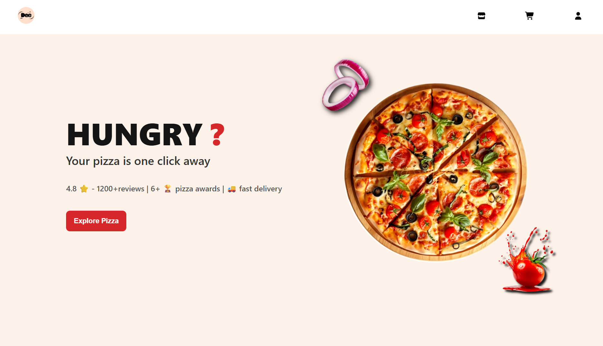
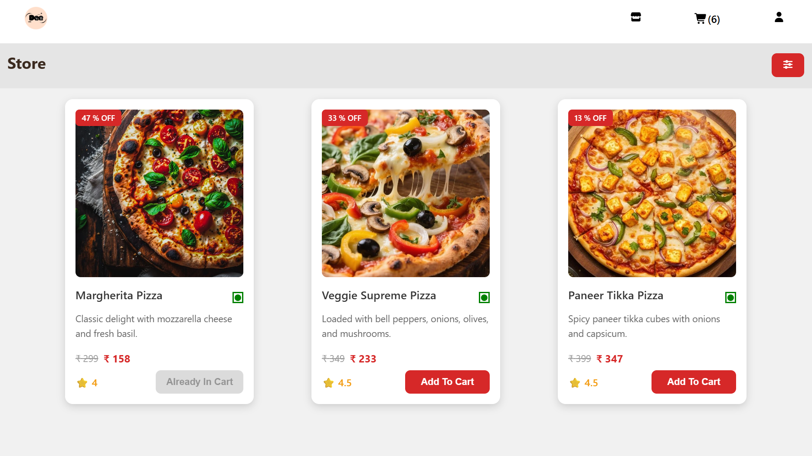
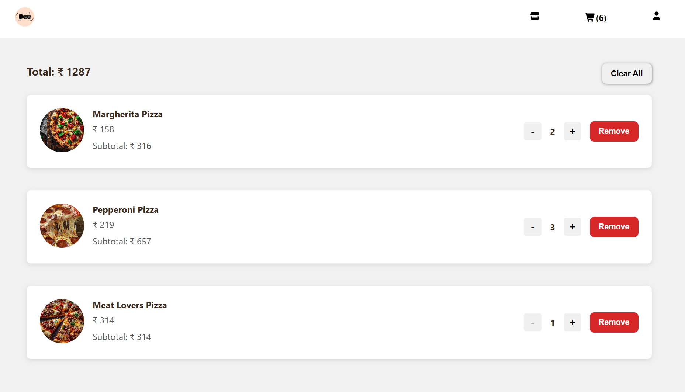
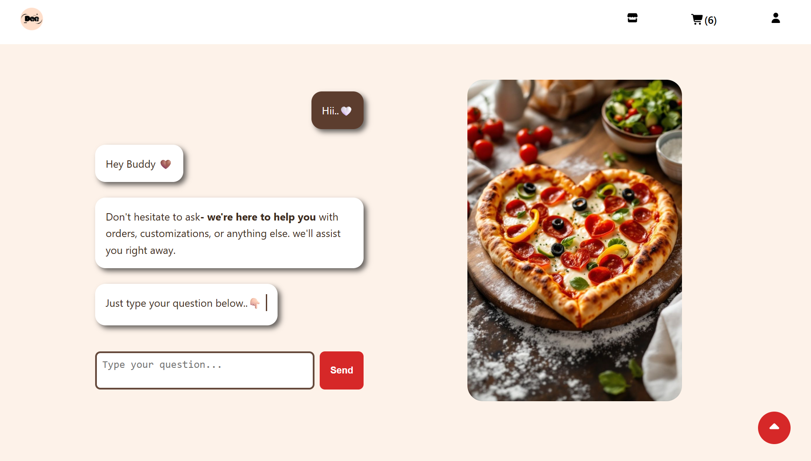
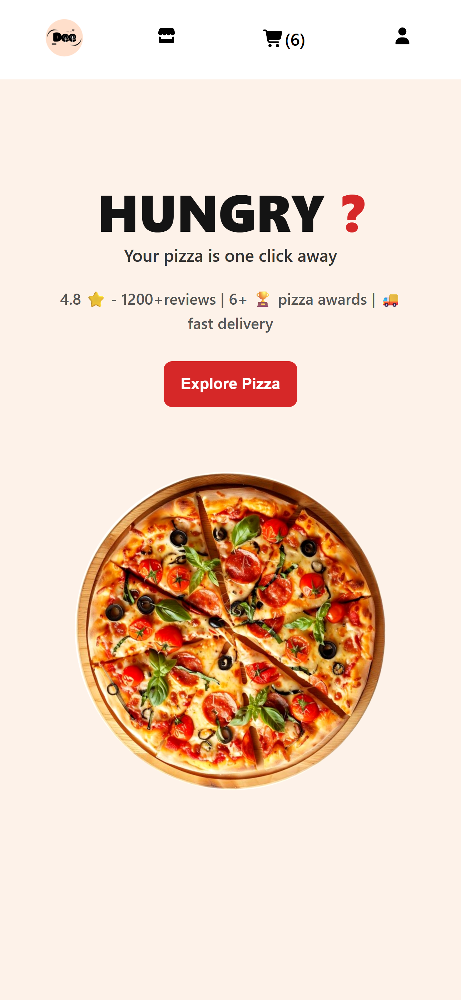
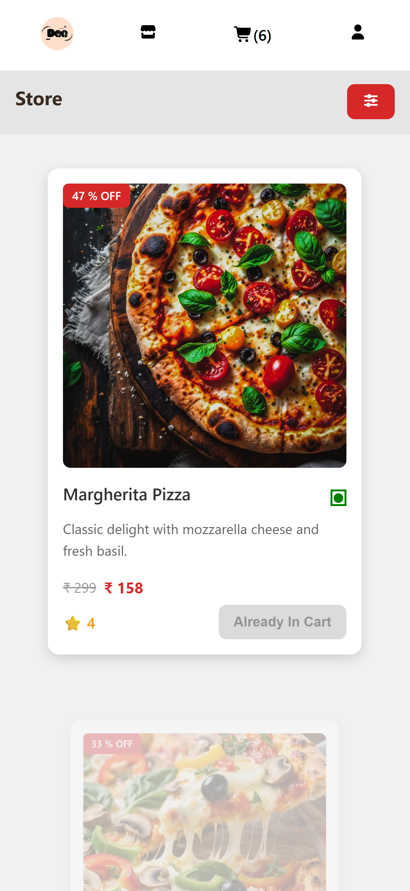
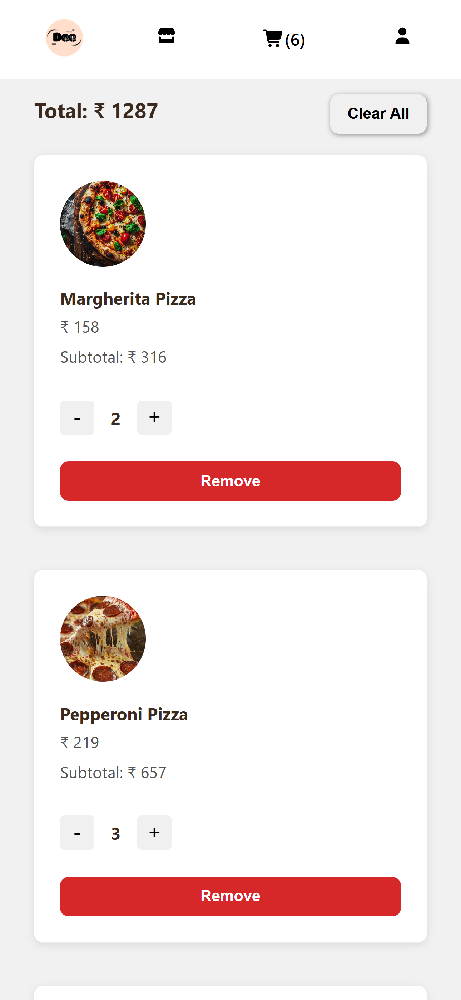
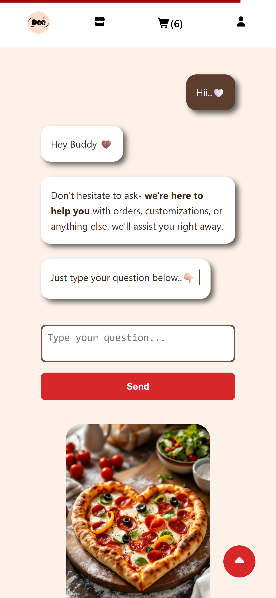

# pizza-ordering-app

A fully responsive pizza delivery web application built with React, featuring advanced filtering, cart management, top offers, and a modern user-friendly UI.

---

## 🚀 Live Demo

👉 (Add your deployed link here)

---

## 📸 Screenshots

### 🖥 Web View

### 📱 Mobile View

---

## 🧩 Features

### 🛍 Product Management

- Dynamic pizza listing fetched from MockAPI
- Data enrichment with:
  - Random discount offers (10–50%)
  - Calculated offer prices
  - Random star ratings
- Centralized image mapping
- Reusable Card component used across the app

### 🔍 Filtering & Search

- Search by pizza name or description
- Price range filter with More Than / Less Than options
- Veg / Non-Veg filter
- Filter Modal with confirm & reset actions

### 🧾 Cart Functionality

- Add to cart with auto-disable for existing items
- Quantity controls (+ / –)
- Dynamic subtotal and total price calculation
- Remove items or clear entire cart
- Empty cart fallback UI with “Go to Store” CTA

### 🎯 Top Offers

- Displays top 3 pizzas with highest discounts
- Dynamically sorted by offer percentage
- Conversion-focused design to highlight savings

### 🧑‍🍳 Build My Pizza

- Customize pizza options:
  - Crust (Thin / Thick)
  - Size (Small / Large)
  - Spice level (Mild / Spicy)
  - Toppings (Veg / Non-Veg)
  - Cheese (Regular / Extra)

### 💬 Customer Support Chat

- Friendly chat interface for user interaction
- Input field with send action
- Improves trust and engagement

### ⚠️ Error & Loading Handling

- Reusable loading spinner with user-friendly message
- Error fallback UI with “Back to Home” button
- Prevents blank screens during API delays

### 🔄 Navigation & UX

- Client-side routing with React Router
- Scroll restoration on route change
- Mobile-first responsive design

---

## 🧠 State Management

- React Context API with useReducer
- Clean separation of UI and business logic
- Utility functions (`cartUtils.js`) for:
  - Total items
  - Total price calculations

---

## 🎨 Design System

- Centralized constants in Data.js
- No hardcoded strings inside components
- Consistent, scalable, localization-ready UI

---

## 📱 Responsive Design

- Mobile-first layout
- Flexbox & Grid-based structure
- Touch-friendly buttons and navigation

---

## 🛠 Tech Stack

- React (Functional Components & Hooks)
- React Router
- Context API + useReducer
- Vite
- CSS (Custom Styling)
- FontAwesome
- MockAPI

---
